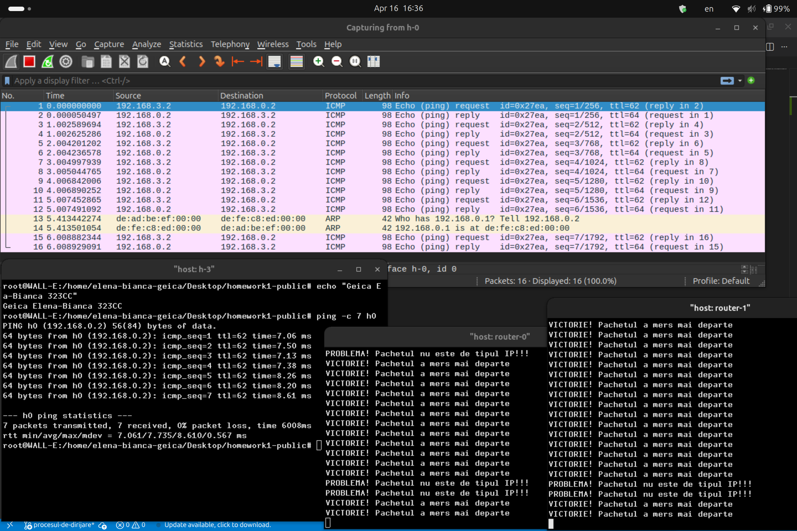
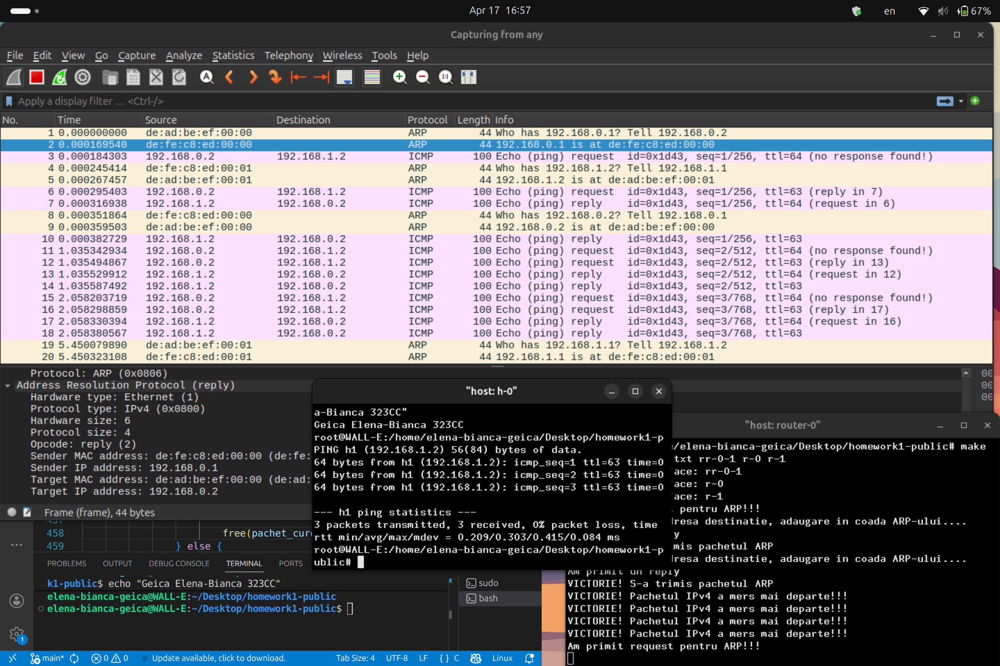
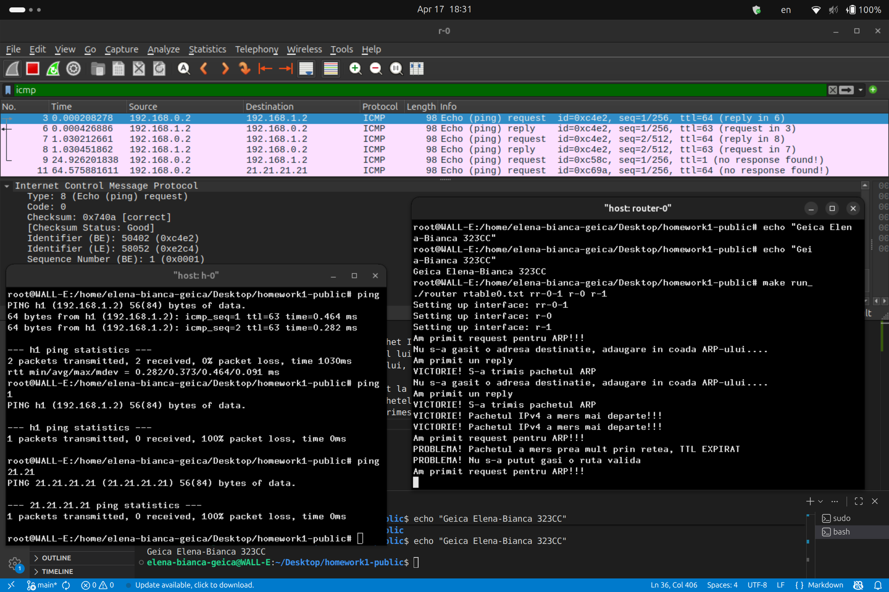

# Router Dataplane Implementation

This repository contains the implementation of a router's dataplane for the first assignment of the Communication Networks course. The project demonstrates core networking functions including IPv4 packet forwarding, Longest Prefix Match (LPM) route lookup via a Trie, dynamic ARP resolution, and ICMP error handling.

---

## Features & Implementation Details

### Exercise 1: IPv4 Packet Forwarding & Routing Process

* **Packet Validation & Processing:** Filters and processes incoming IPv4 packets. Packets non-compliant with the IPv4 protocol are dropped, with appropriate debug logs generated in the router terminal.
* **TTL Management & Checksum Recalculation:** For every valid forwarded IPv4 packet, the Time To Live (TTL) is decremented. The IP header checksum is recalculated to ensure packets are not dropped downstream due to corruption checks.
* **L2 Header Updates:** At the Ethernet layer, the source MAC address is updated to the router's outgoing interface MAC address, and the destination MAC address is updated to the next-hop MAC address.
* **Wireshark Analysis:**
  * Captures demonstrate ICMP Request and Reply packets forwarded between Host 3 and Host 0 across two router hops.
  * Packets sent with an initial TTL of 64 arrive at the destination with a TTL of 62, confirming successful processing and decrementing through both router hops.

---

### Exercise 2: Efficient Longest Prefix Match (Trie Data Structure)

To optimize route table lookups beyond standard linear search, a **Trie (Prefix Tree)** data structure was implemented:

* **Custom Node Structure:** Modified the standard trie node structure to store pointers directly to routing table entries (`route_table_entry`) instead of boolean flags.
* **Core Functions:**
  * `init_trie()` / Constructor: Allocates memory and initializes the tree root.
  * `insert()`: Populates the Trie with subnets and masks from the routing table.
  * `search()`: Traverses the bit-level structure of the IP address to find and return the longest matching prefix entry.

---

### Exercise 3: Dynamic ARP Protocol & Packet Queueing

Because static MAC mapping is impractical, the router was upgraded to handle ARP requests and replies dynamically using an **ARP Cache** and a **Packet Queue**:

* **ARP Request Handling:** Upon receiving an ARP request targeting the router's IP address, the router constructs an ARP Reply containing its interface MAC address and sends it back to the requester.
* **Packet Queueing & Resolution:** 
  * When forwarding an IPv4 packet whose next-hop MAC address is unknown, the router queues the packet and broadcasts an ARP Request for the target IP.
  * Once an ARP Reply is received, the IP-MAC pair is stored in the ARP cache, queued packets are retrieved, their Ethernet headers are completed, and they are transmitted onto the wire.

---

### Exercise 4: ICMP Protocol & Error Reporting

The ICMP protocol implementation handles diagnostic messaging and error reporting for invalid or unroutable packets:

* **Echo Request / Reply:** Successfully routed valid ping requests between hosts.
* **Time Exceeded (TTL Expired):** Packets with a TTL value reaching 0 or 1 are dropped, triggering an ICMP Time Exceeded message back to the sender alongside terminal debug logs.
* **Destination Unreachable:** If a destination IP cannot be resolved via the Trie lookup, the packet is dropped, and an ICMP Destination Unreachable message is returned.

